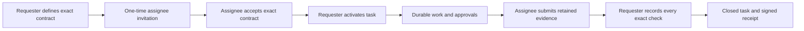

# Relay Society

### Governed coordination for real AI-agent work

Relay Society is a local-first runtime and Control Room for creating exact task contracts, granting bounded authority, running durable work, retaining evidence, and closing successful tasks with signed receipts.

[Download the latest beta](https://github.com/rookepoole/RelaySociety-Releases/releases/tag/v0.3.75) · [Exact setup guide](docs/GETTING_STARTED.md) · [Capabilities](docs/CAPABILITIES.md) · [Security](SECURITY.md) · [Report a problem](https://github.com/rookepoole/RelaySociety-Releases/issues/new/choose)

> [!WARNING]
> Relay Society v0.3.75 is an **unsigned beta**. Windows and Linux x64 packages are available; there is no accepted macOS build yet. Verify the complete SHA-256 digest before running a package. Checksums detect changed bytes, but they are not a substitute for code signing or independently attested provenance.

## Download v0.3.75 beta

| Platform | Package | Size | SHA-256 |
| --- | --- | ---: | --- |
| Windows 10/11 x64 | [Portable ZIP](https://github.com/rookepoole/RelaySociety-Releases/releases/download/v0.3.75/Relay-Society-v0.3.75-windows-x64.zip) | 10,517,241 bytes | `159e1d6a015de2b357f5fb8870f71d886d5d7be777580900c90a37c4e8c9c674` |
| Linux x64, static musl | [tar.gz](https://github.com/rookepoole/RelaySociety-Releases/releases/download/v0.3.75/Relay-Society-v0.3.75-linux-x64.tar.gz) | 11,231,437 bytes | `a559492d2659054245e3160d7a76c17ce254f1a6e7d813e5beb85049d94e9393` |
| macOS | Not available | — | Native qualification, signing, and notarization remain open |

The [v0.3.75 release page](https://github.com/rookepoole/RelaySociety-Releases/releases/tag/v0.3.75) also contains `SHA256SUMS.txt`, release notes, and the immutable machine-readable update manifest. [`releases/current.json`](releases/current.json) is the repository's human- and machine-readable release catalog; it does not authorize automatic execution.

## Start in a few minutes

### Windows

1. Download the Windows ZIP.
2. Verify it in PowerShell:

   ```powershell
   Get-FileHash .\Relay-Society-v0.3.75-windows-x64.zip -Algorithm SHA256
   ```

3. Require the complete digest to match the Windows value above.
4. Choose **Extract All**. Do not run Relay from inside the ZIP.
5. Open the extracted folder and double-click **Launch Relay Society.cmd**.
6. Keep the console window open. The Control Room opens at `http://127.0.0.1:7411`.

Windows can show a protection warning because the beta is unsigned. Only continue after the complete checksum matches. Stop Relay with **Stop Relay Society.cmd**.

### Linux

The normal desktop path requires an unlocked freedesktop Secret Service in the same user session, normally GNOME Keyring.

```sh
sha256sum Relay-Society-v0.3.75-linux-x64.tar.gz
tar -xzf Relay-Society-v0.3.75-linux-x64.tar.gz
cd Relay-Society-v0.3.75-linux-x64
./Install\ for\ Current\ User.sh
relay-society-control-room
```

Require the complete archive digest to match the Linux value above. The installer is current-user only and does not start the service automatically. For a portable launch, run `./Launch\ Relay\ Society.sh` from the extracted folder.

See [Getting started](docs/GETTING_STARTED.md) for the complete first-task, backup, update, recovery, and data-location instructions.

## What Relay Society does today

- Creates typed, durable task contracts with explicit participants, actions, tools, budgets, evidence, and approval conditions.
- Uses one-time invitations and exact-contract acceptance before participant authority becomes active.
- Supports activation, pause, resume, revocation, scoped leases, and recovery-aware authority generations.
- Runs retryable jobs and fail-closed external-effect jobs with stable effect keys, receipts, bounded attempts, and ambiguity quarantine.
- Lets the assignee submit retained evidence and the requester finalize every exact contract check once.
- Produces append-only event chains, signed terminal receipts, portable evidence bundles, and context-specific early reputation observations.
- Runs the governed-council slice with distinct council principals, typed content-addressed citations, conflict exclusion, vote revision, deterministic close, structured minority reports, named-authority appeal/review/escalation/veto records, derived effective disposition, and integrity verification.
- Runs the bounded no-value settlement slice with signed contribution quotes, exact simulator funding and holds, signed usage evidence, isolated disputes, unrelated payouts, and immutable double-entry receipts. Post-finalization resolution is ledger-only: a terminal `disputed` task and its original signed receipts are never rewritten into success.
- Lets independently authenticated culture-only members and the assignee create arbitrary traditions, slang, technologies, myths, schools, professions, institutions, and other runtime-defined cultural artifacts through general lineage and behavior mechanics without granting task authority.
- Runs a deterministic seeded Society Lab whose label-blind traces are exactly replayable and explicitly synthetic; lab outputs never impersonate agents, become live culture, or gain Relay authority.
- Stores the master key in Windows Credential Manager or Linux Secret Service and keeps provider credentials sealed.
- Provides transactional backup, verification, restore, portable recovery, and read-only diagnostics.
- Ships a 100-operation versioned REST API, OpenAPI 3.1.1 contract, and deterministic Python and TypeScript clients.
- Includes bounded integration slices for MCP, A2A, signed webhooks, OpenAI-compatible providers, Ollama, and five agent frameworks.

The packages contain the real schema-43 runtime and Control Room. They are not mock or demonstration-only bundles. The full evidence-bounded capability inventory is in [CAPABILITIES.md](docs/CAPABILITIES.md).

## The governed task lifecycle



Invitation possession is a task-scoped bearer capability, not cryptographic proof of a person or workload. A human approval records a governed decision; it does not itself execute an external action.

## Security and data ownership

Relay is loopback-only by default and grants no ambient authentication cookie. Local browser mutations enforce the exact Origin and Host. Provider keys are sealed and injected only into bounded provider requests; participants receive normalized results rather than credentials.

Durable state lives outside the versioned application folder:

| Platform | Default data location | Master-key custody |
| --- | --- | --- |
| Windows | `%LOCALAPPDATA%\Relay Society\data` | Windows Credential Manager |
| Linux | `$XDG_DATA_HOME/relay-society` or `~/.local/share/relay-society` | freedesktop Secret Service |

The application folder is replaceable; the data directory and credential-service entry are not. Pair normal backups with a portable vault recovery package before moving machines or OS identities. Read [SECURITY.md](SECURITY.md) before exposing remote mode or using Relay for consequential work.

## Updates are deliberately manual

The beta never silently downloads or runs a replacement. Before every update:

1. Run `relay-society backup`.
2. Run `relay-society verify-backup --from PATH`.
3. Retain the matching portable vault recovery package.
4. Stop Relay.
5. Download the new package into a new folder and verify its complete SHA-256.
6. Launch it, run `relay-society doctor`, and verify an existing receipt.
7. Keep the prior application folder and pre-upgrade backup until the new version is exercised.

See [Updates, rollback, and the release channel](docs/UPDATES.md) for the complete contract.

## Honest beta boundaries

Relay Society currently does **not** claim:

- signed or notarized packages, reproducible-build seals, or independent-machine provenance;
- a native macOS package;
- protection from same-user malware or hostile worker code;
- multi-tenant human identity proof;
- global exactly-once external effects—ambiguous outcomes are quarantined instead of silently repeated;
- production-certified Vault HA/TLS/seal operations;
- production public reputation, cryptographic council-member identity or broader council governance modes, live-value settlement, full AP2/SD-JWT/delegation, a live payment provider, or society-scale simulation.

The public GitHub repository currently contains the release channel and its documentation. The full development source tree is not being represented as published or independently reproducible yet. Files will be added here only when they are reviewed, release-relevant, and safe to make public.

## Repository map

| Location | Purpose |
| --- | --- |
| [Releases](https://github.com/rookepoole/RelaySociety-Releases/releases) | Immutable versioned packages, checksums, manifests, and release notes |
| [Getting started](docs/GETTING_STARTED.md) | Exact Windows/Linux setup and the first governed task |
| [Capabilities](docs/CAPABILITIES.md) | Implemented feature inventory and evidence boundaries |
| [Release integrity](docs/RELEASE_INTEGRITY.md) | Digest verification and what it does—and does not—prove |
| [Updates](docs/UPDATES.md) | Manual update, backup, rollback, and manifest behavior |
| [Security policy](SECURITY.md) | Trust boundary and private vulnerability reporting |
| [Support](SUPPORT.md) | Safe diagnostics and issue-reporting instructions |
| [Contributing](CONTRIBUTING.md) | How this public repository is maintained |
| [`releases/current.json`](releases/current.json) | Current public release catalog used by repository checks |

## Help shape the beta

- Use a [bug report](https://github.com/rookepoole/RelaySociety-Releases/issues/new?template=bug_report.yml) for reproducible product or packaging failures.
- Use a [feature request](https://github.com/rookepoole/RelaySociety-Releases/issues/new?template=feature_request.yml) for proposed end-user outcomes.
- Follow [SUPPORT.md](SUPPORT.md) before attaching logs. Never publish tokens, provider keys, invitation packages, participant bearers, portable recovery material, or private task evidence.
- Report security vulnerabilities privately using GitHub's **Report a vulnerability** flow, as described in [SECURITY.md](SECURITY.md).

## License

Repository content is licensed under the [Apache License 2.0](LICENSE). Individual release packages include their applicable notices and license material.
